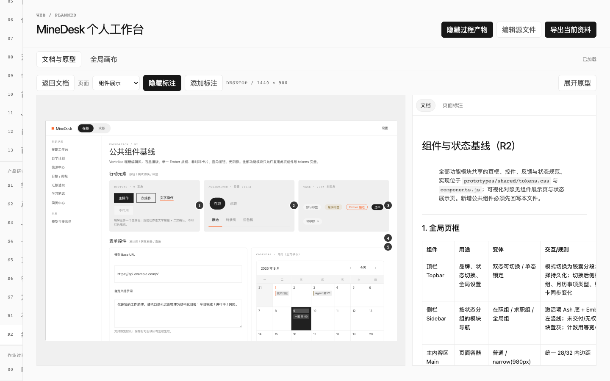
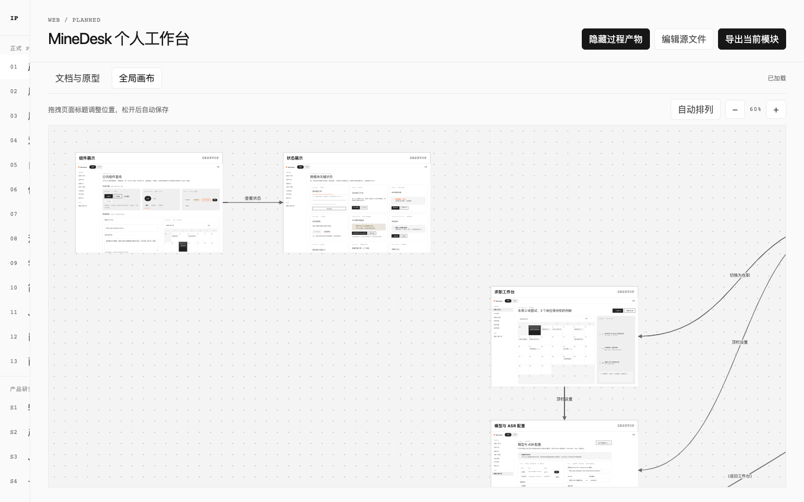
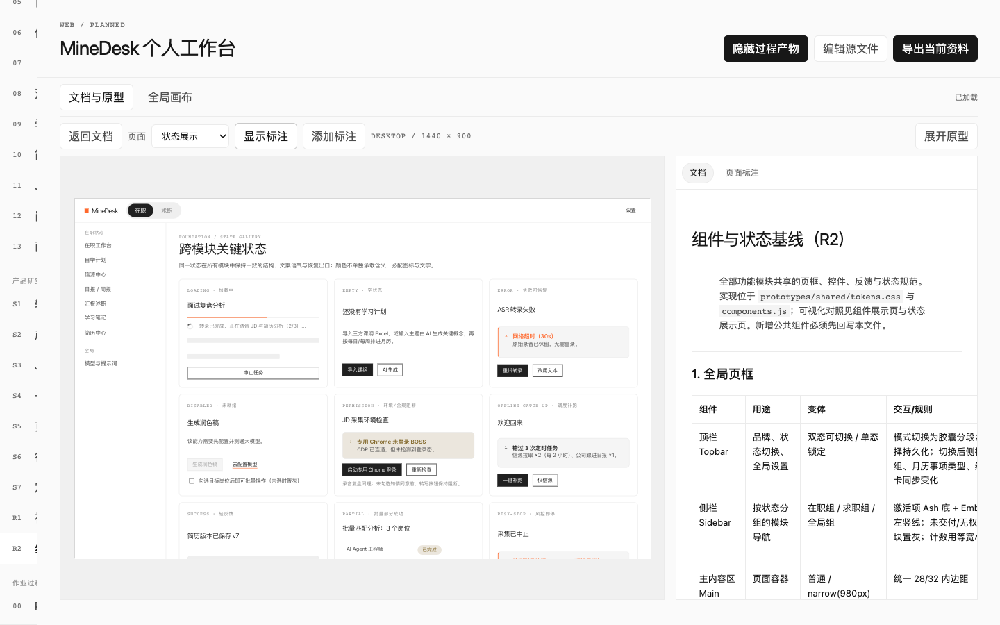

# Living PRD

把产品想法逐步交付为可编辑、可演示、可导出的**活文档 PRD 工作区** —— 为 AI Coding Agent 设计的 Skill。

## 为什么叫 Living PRD

传统 PRD 是一次性快照：交付即过时。Living PRD 让 PRD 变成"活"的：

- **可交互**：每个功能模块都带可点击的网页原型、气泡标注和页面关系画布，读者直接"用"产品，而不是"读"文档
- **可迭代**：所有产物是本地 Markdown / HTML / JSON，随需求演进持续修改，不做一次性交付
- **可追溯**：门禁式作业流（G0–G5）加迭代记录，每一步决策、审核和修改都有据可查

## 来源与致谢

本项目 fork 自 [comeonzhj/interaction-prd](https://github.com/comeonzhj/interaction-prd)（MIT），在其门禁式作业流、可视化底座与数据契约之上独立迭代。上游版本的完整决策记录（v0.1.0–v0.8.0）原样保留在 [ITERATION_LOG.md](ITERATION_LOG.md)，本仓库的迭代条目追加在同一文件。感谢原作者的出色设计。

## 这是什么

Living PRD 是一个遵循 [Agent Skills](https://agentskills.io/) 规范的 Skill，让 AI Agent 能够：

- 通过多轮对话**澄清产品想法**，逐步收敛为结构化 PRD
- 或者从**已有 Demo 代码**还原产品功能、规则和边界
- 生成包含**可交互网页原型**、**气泡标注**、**目录导航**和**页面关系画布**的完整 PRD 工作区
- 所有产物**本地可编辑**，支持实时预览和导出

> 适用于从粗糙想法、shaping 文档或 Coding Agent 产出的产品 Demo 代码新建或继续交互 PRD。纯静态文档不需要使用本 Skill。

## 核心特性

### 🧭 门禁式作业流

严格按 **G0 → G5** 六个门禁推进，每个门禁等待用户确认后才进入下一步：

| 门禁 | 内容 |
|------|------|
| **G0 产品定型** | 通过多轮对话或代码分析收敛产品定位、用户、场景和 MVP 范围 |
| **G1 板块计划** | 规划 PRD 模块的目标、边界、依赖和审核标准 |
| **G2 PRD 基础分析** | 交付产品定义、用户需求分析、用户故事与旅程 |
| **G3 设计参考基线** | 确认视觉规范，建立组件与状态参考 |
| **G4 逐模块交付** | 逐个提交 PRD + 原型 + 标注，逐一审核 |
| **G5 全局收口** | 全量检查模块、页面、状态、标注和导出 |

### 🎨 可视化底座

底座（Runtime）是一个本地 Web 应用，提供：

- **文档与原型同页对照**：约 2:1 布局，左侧原型、右侧审阅栏
- **全局画布**：基于页面关系自动分层布局，支持拖拽微调
- **气泡标注**：优先使用稳定 CSS 选择器锚定，支持坐标回退
- **分组目录**：正式 PRD / 产品研究与参考 / 作业过程三组分明
- **导出能力**：PRD Markdown + 原型截图资料包；另可一键复制 / 下载飞书、Notion 友好 Markdown

### 🔍 两种入口

| 入口 | 适用场景 | 特点 |
|------|---------|------|
| **想法 / Shaping** | 用户有粗糙需求或产品材料 | 通过对话逐步澄清，多轮问答收敛 |
| **Demo 代码** | 用户有可访问的产品 Demo 代码 | 从代码还原功能、规则、边界，区分"已实现事实"与"产品意图" |

## 安装

### 使用 npx skills（推荐）

```bash
npx skills add ZLX0071/living-prd
```

安装后，Skill 会被放置到当前项目的 skills 目录（或你使用的 Agent 对应的 skills 目录），并自动被 Agent 识别。

如需全局安装（所有项目可用）：

```bash
npx skills add ZLX0071/living-prd -g
```

### 手动克隆

```bash
git clone https://github.com/ZLX0071/living-prd.git
```

然后将 `SKILL.md` 和相关文件放到你的 Agent skills 目录中。

## 快速开始

安装 Skill 后，对你的 AI Agent 说：

**从想法开始：**

> "用 living-prd 帮我把这个产品想法做成活文档 PRD 工作区：[你的产品描述]"

**从 Demo 代码开始：**

> "用 living-prd 从这个 Demo 代码还原产品 PRD：[代码目录路径]"

### 工作区初始化

Agent 会运行初始化脚本创建工作区：

```bash
# 从想法入口
python3 <skill-root>/scripts/init_living_prd.py --name "产品名" --type "Web"

# 从 Demo 代码入口
python3 <skill-root>/scripts/init_living_prd.py --name "产品名" --type "Web" \
  --source-mode demo --source-path "./demo-code"
```

### 启动底座

```bash
cd <workspace>
npm install
npm run dev     # 启动本地底座
npm run validate # 验证 manifest、文件引用和标注坐标
```

## 示例截图

### 文档阅读视图

默认打开第一个正式 PRD 模块，支持 Markdown 渲染和 Mermaid 图表。


### 原型对照模式

点击"对照原型"进入约 2:1 布局，左侧原型、右侧审阅栏，可切换文档与页面标注。


### 气泡标注

在原型上添加标注，优先使用稳定 CSS 选择器锚定，点击气泡自动定位到标注列表。



### 全局画布

基于页面关系自动分层布局，展示所有页面的跳转关系，支持拖拽微调。



### 状态展示页

多状态并列展示，便于设计师和开发者理解各种边界情况。



## 工作区结构

```
<workspace>/
├── living-prd.json           # 唯一索引，管理模块、页面、关系和坐标
├── shaping/                   # 产品定型文档（S0–S7）
│   ├── 00-code-evidence.md   # Demo 代码入口专属
│   ├── 00-competitive-analysis.md  # 竞品分析（S0）
│   ├── 00-intake.md
│   ├── 01-product-shaping.md
│   ├── 02-jtbd.md
│   ├── 03-scope.md
│   ├── 04-pages-and-flows.md
│   ├── 05-open-questions.md
│   └── 06-shaped-brief.md
├── prd/                       # 正式 PRD 模块（01–N）
│   ├── 00-plan.md            # 过程产物，最终交付前隐藏
│   ├── 01-product-definition.md
│   ├── 02-users-and-needs.md
│   ├── 03-user-stories-and-journey.md
│   └── 04-metrics-and-north-star.md
├── reference/                 # 设计参考（R1–R2）
│   ├── DESIGN.md
│   └── components-and-states.md
├── annotations/               # 页面标注 JSON
├── prototypes/                # 原型 HTML
│   ├── shared/               # 共享样式和组件
│   └── pages/                # 原型页面
├── runtime/                   # 底座实现（通常不修改）
└── exports/                   # 导出产物
```

## Skill 仓库结构

```
living-prd/
├── SKILL.md                  # Skill 指令（Agent 入口）
├── README.md                 # 本文件
├── AGENTS.md                 # 仓库维护规范
├── ITERATION_LOG.md          # 版本迭代记录（含上游决策记录）
├── LICENSE                   # MIT 许可（含上游版权声明）
├── agents/
│   └── openai.yaml           # OpenAI Agent 配置
├── references/               # 参考规范
│   ├── authoring-workflow.md
│   ├── content-contract.md
│   ├── product-shaping.md
│   ├── code-demo-intake.md
│   └── visual-system.md
├── scripts/
│   └── init_living_prd.py    # 工作区初始化脚本
└── assets/
    └── runtime/              # 底座模板
```

## 数据契约

- `living-prd.json` 是唯一索引，管理模块、页面、设备尺寸和关系
- 每个原型页是独立 HTML，共享 `prototypes/shared/` 中的样式和组件
- 标注按页面独立保存为 JSON，优先使用稳定 CSS 选择器锚定
- 模块使用 `kind` 区分信息层级：`prd`（正式交付）、`shaping`（定型依据）、`reference`（设计参考）、`process`（可隐藏过程产物）

## 视觉规范

默认使用简洁单色规范（近白画布、近黑文字、发丝边框），详见 [visual-system.md](references/visual-system.md)。用户可提供自己的品牌/设计规范覆盖默认方案。

## 版本记录

当前版本：**v0.11.0** — fork 自 [interaction-prd](https://github.com/comeonzhj/interaction-prd) v0.8.0。本仓库已交付：品牌更名与 `living-prd.json` 数据契约（v0.9.0）、数据与北极星指标基础板块 + 竞品分析 S0（v0.10.0）、飞书/Notion Markdown 导出（v0.11.0）。

详见 [ITERATION_LOG.md](ITERATION_LOG.md)。

## 许可

MIT。本仓库在 [comeonzhj/interaction-prd](https://github.com/comeonzhj/interaction-prd)（MIT）基础上迭代，版权声明见 [LICENSE](LICENSE)。
