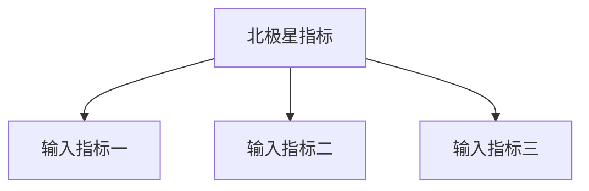

# 数据与北极星指标

> 将已确认的 shaping 结论转写为面向最终读者的正式 PRD 板块。北极星指标回答"产品为用户交付的核心价值用什么衡量"；本板块在进入功能模块（G4）前确认，避免功能交付与价值脱钩。不要只引用 shaping 文件，也不要保留 `[待确认]` 占位。

## 北极星指标

| 项目 | 内容 |
| --- | --- |
| 北极星指标 | [待确认: 一个可度量、可影响、表达用户核心价值的指标] |
| 定义与口径 | [待确认: 分子/分母、时间窗口、去重规则] |
| 为什么是它 | [待确认: 与用户价值和商业价值的因果关系] |
| 当前基线 | [待确认: 无数据时写明测量计划，不得虚构] |
| 目标 | [待确认: 时间窗口 + 数值] |

## 指标树

| 输入指标 | 定义 | 与北极星的关系 | 对应功能模块 |
| --- | --- | --- | --- |
| [待确认] | [待确认] | [待确认] | [待确认] |

## 护栏指标

| 指标 | 定义 | 阈值/红线 | 监控方式 |
| --- | --- | --- | --- |
| [待确认: 如崩溃率、客诉率、次日留存跌幅] | [待确认] | [待确认] | [待确认] |

## 反例与虚荣指标

- [待确认: 明确列出本期不作为成功依据的指标及理由，如累计下载量、PV]

## 数据来源与埋点需求

| 指标 | 数据来源 | 埋点/事件 | 负责人 |
| --- | --- | --- | --- |
| [待确认] | [待确认] | [待确认] | [待确认] |

## 未决问题

| 问题 | 影响 | 结论 |
| --- | --- | --- |
| [待确认] | [待确认] | [待确认] |
