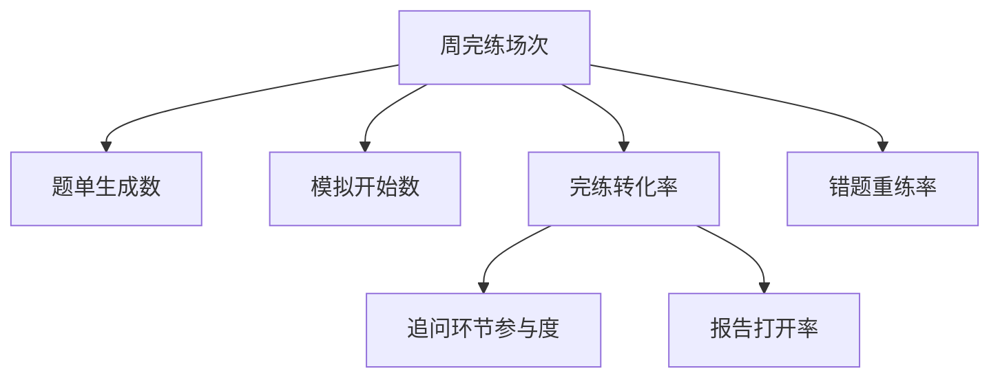

# 数据与北极星指标

## 北极星指标

| 项目 | 内容 |
| --- | --- |
| 北极星指标 | 周完练场次（每用户每周完成整场模拟的次数） |
| 定义与口径 | 自然周内，状态为"已完练"的整场模拟次数；单题精练不计入；同一用户同周去重按场次计 |
| 为什么是它 | 完练一场 = 用户完整经历"练-评"闭环，同时反映价值交付（练到位）与成本发生（模型调用）；比"对话条数"更难刷、比"注册数"更贴价值 |
| 当前基线 | 无数据；上线首周建立基线，测量计划见下 |
| 目标 | 新用户首周 ≥ 2 场；全量活跃用户周均 ≥ 1.5 场（上线 4 周内） |

## 指标树

| 输入指标 | 定义 | 与北极星的关系 | 对应功能模块 |
| --- | --- | --- | --- |
| 题单生成数 | 成功生成题单的次数 | 生成是练习的前置 | prep-planner |
| 模拟开始数 | 点击"开始模拟"的场次 | 漏斗上层 | mock-interview |
| 完练转化率 | 完练场次/开始场次 | 直接决定北极星 | mock-interview |
| 报告打开率 | 完练后打开报告占比 | 报告是下一次练习的理由 | report-review |
| 错题重练率 | 错题 7 日内被重练占比 | 闭环回流的来源 | report-review |

## 护栏指标

| 指标 | 定义 | 阈值/红线 | 监控方式 |
| --- | --- | --- | --- |
| 完练时长异常占比 | 单场 <5 分钟即完练的占比 | >15% 触发反作弊/规则审视 | 埋点 |
| 反馈有用率 | 报告页"有用"点击/报告打开 | <60% 触发 prompt 复盘 | 报告页事件 |
| 单场模型成本 | 单完练场次token成本 | 超预算 20% 触发限额调整 | 服务端计费日志 |

## 反例与虚荣指标

- 累计注册数：不代表任何人练过一场。
- 对话消息数：可被无意义输入刷高，与价值无关。
- 题单生成数单列时：只生成不练是漏斗泄漏，不作为成功依据。

## 数据来源与埋点需求

| 指标 | 数据来源 | 埋点/事件 | 负责人 |
| --- | --- | --- | --- |
| 完练场次 | 服务端场次状态机 | session_complete / session_abort | 客户端+服务端 |
| 报告打开/有用 | 前端事件 | report_open / report_feedback | 前端 |
| 错题重练 | 服务端 | mistake_retrain | 服务端 |
| 生成耗时 | 服务端 | questiongen_latency | 服务端 |

> 测量计划：上线前完成埋点评审；无历史数据阶段以"上线首周"为基线窗口，不虚构基线值。
