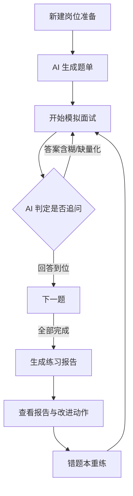

# 页面与流程

## 页面清单

| 页面 | 用户任务 | 核心信息 | 主要操作 | 入口/出口 |
| --- | --- | --- | --- | --- |
| 岗位准备（prep-home） | 管理准备对象、新建准备 | 岗位卡列表（进度/错题数）、新建表单 | 新建、生成题单、进入面试/报告 | 首页；出口→面试、报告 |
| 模拟面试（interview-session） | 完成带追问的作答 | 进度/计时、对话流、提示余量 | 作答、请求提示、结束、放弃 | 入口←准备；出口→报告、状态页 |
| 面试边界状态（interview-states） | 并列查看异常状态 | 次数用尽/网络错误/退出确认等 | — | 从面试页查看 |
| 练习报告（report-detail） | 看评分与改进建议 | 总分、四维、逐题卡 | 查看建议、去错题本、分享 | 入口←面试；出口→错题本 |
| 错题本（mistake-book） | 复盘重练 | 错题列表（得分/状态） | 标记已掌握、重练 | 入口←报告；出口→面试 |

## 主流程

## 关键状态

| 对象 | 状态 | 触发条件 | 可执行操作 |
| --- | --- | --- | --- |
| 题单 | 生成中/失败/就绪 | 提交新建后 | 等待、重试、查看 |
| 场次 | 进行中/未完练/已完练/次数用尽 | 作答或放弃 | 继续、放弃（需确认）、次日恢复 |
| 报告 | 生成中/失败/已生成 | 场次完练后 | 重试、查看、分享 |
| 错题 | 未掌握/已掌握 | 入本或手动标记 | 重练、标记 |
